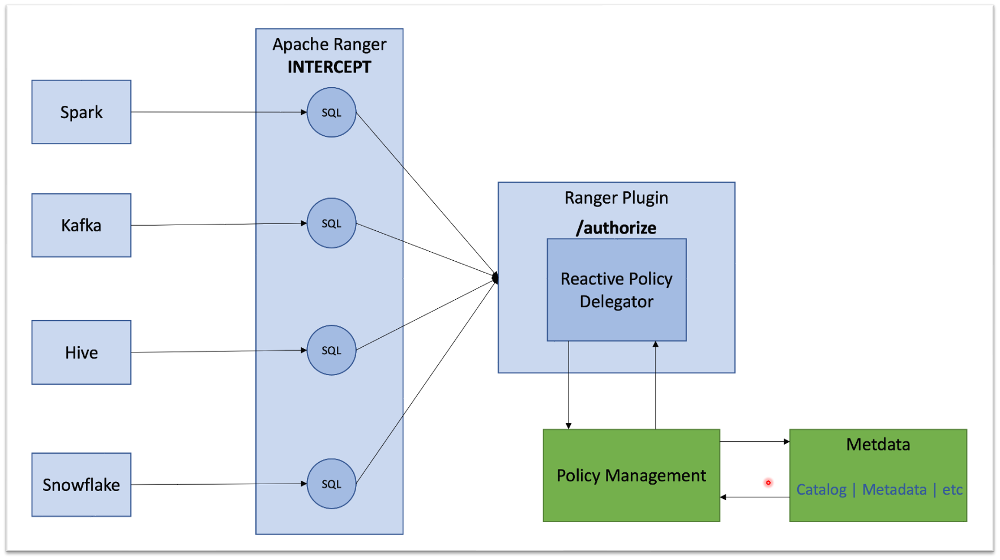
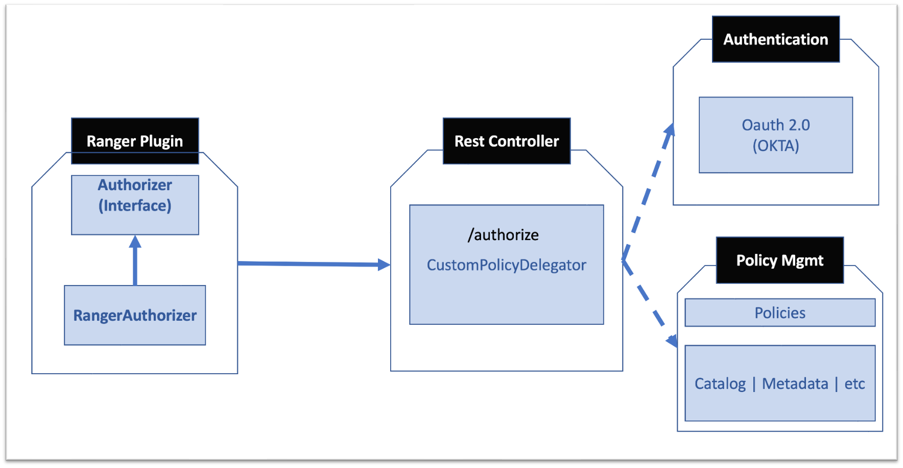
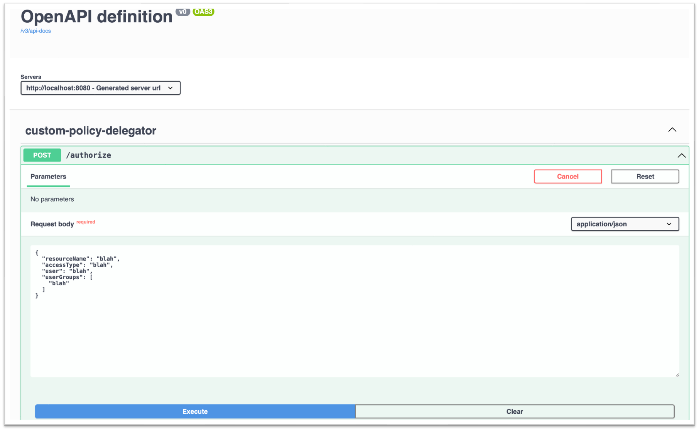

# Customized Policies Using Ranger - APIs driven policies access management
This blog demonstrates policies based access to the resource on the datalake/lakehouse, topics/streams, 
data warehouse  (Hive, Snowflake) etc using Apache Ranger.

*NOTE* The blog will not go in details about how copy jars in the Ranger lib, so that it can be launched as a javaagent. 
Apache Ranger documentation has extensively covered that.

Apache Ranger helps in applying interception based policies to the resources. However, typically company uses, catalogs to store the 
metadata information like data owner, data classification etc etc, based on your companies' domain classification using domain 
driven design. It's ideal to enforce policies based on this cataloging information. This helps two folds:
- enforce policies based on metadata
- centrally govern the policies

However, now the question arises, how can we integrate Ranger
with such an ecosystem.

Apache Ranger architecture provides ability to provide custom plugin to accomplish this. These plugins are activated at 
start/launch of the JVM. Using bytecode weaving, all access call to the resources are redirected to plugin, hence 
providing abilities to integrate with the companies' ecosystem like catalog & authentication systems.

The following picture shows the architecture:



The above architecture is a microservices' architecture, where any access to resources on the datalake/lakehouse etc are 
intercepted and forwarded to /authorize REST apis, which then connect to your company ecosystem to enforce policies. A 
classical example are applying GDPR compliance based policies.

The starting point of the design implementation, is a notion of *Authorizer*. This class is central to the Ranger plugin.
The concrete implementation is *RangerAuthorizer*. So here is the flow:
- All the calls to access a resource will be intercepted by Ranger and passed to RangerAuthorizer
- RangerAuthorizer forward the call *CustomPolicyDelegator*.
- CustomPolicyDelegator provides configurable REST service as outlined below, in the application.properties file
- The configured service takes the ownership of authorization access looking the metadata information along with user & groups 
  it belongs to along with policies configured to  provide access. 



### How to build the Ranger plugin

- Build assemble plugin
  ````shell
  mvn clean package -DskipTests
  ````
- Following files created by the build will be required to setup
  - target/rangercustomplugiin-0.0.1-SNAPSHOT.jar
- move the jar to apache ranger installation
- specify following property so that delegator kicks in the file appliation.properties
  ````
  com.gonnect.policy.delegator.controller=http://localhost:8080/authorize
  ````  
### Setup RESTful App
- Run the app using following command:
  ````
    java -jar rangercustomplugin-0.0.1-SNAPSHOT.jar
  ````
- to run locally and test, set the following properties before packaging
  ````
    com.gonnect.custom.authorizer=http://localhost:8080/mock/
  ````
  
  Once the app is launch, access the apis using following url
  ```shell
    http://localhost:8080/swagger-ui.html
  ```
   You should see the following screen:




### Conclusions
Currently, the mock API is mocking OAUTH and Policy management. However, it does provide clarity on the
interception based policies enforcement. In application world, this type of authorization enforcement is quite
a common practice.
This service helps decouple authorization from a cloud based access management. As a consequence, provide abilities
to write policies using Apache Ranger based data tagging (metadata). These metadata lives/resides in Metadata lake like collibra.


### Tech stack usedReference Documentation
For further reference, please consider the following sections:

* [Official Apache Maven documentation](https://maven.apache.org/guides/index.html)
* [Spring Boot Maven Plugin Reference Guide](https://docs.spring.io/spring-boot/docs/2.7.0/maven-plugin/reference/html/)
* [Create an OCI image](https://docs.spring.io/spring-boot/docs/2.7.0/maven-plugin/reference/html/#build-image)
* [Spring Web](https://docs.spring.io/spring-boot/docs/2.7.0/reference/htmlsingle/#boot-features-developing-web-applications)
* [Apache Ranger](https://ranger.apache.org/)

### Guides
The following guides illustrate how to use some features concretely:

* [Building a RESTful Web Service](https://spring.io/guides/gs/rest-service/)
* [Serving Web Content with Spring MVC](https://spring.io/guides/gs/serving-web-content/)
* [Building REST services with Spring](https://spring.io/guides/tutorials/bookmarks/)

