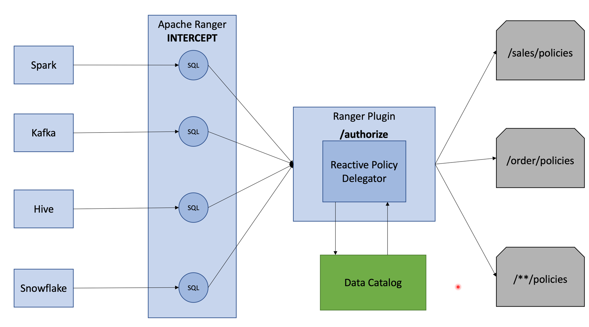

# Custom Ranger Policy 
This blog demonstrates policies based access to the resource on the datalake/lakehouse, topics/streams, 
data warehouse  (Hive, Snowflake) etc using Apache Ranger.

Apache Ranger helps in applying interception based policies to the resources. However, each use catalogs to store the 
metadata information like data owner, data classification etc etc, based your companies domain classification using domain 
driven design. Now the question arises, how can we integrate Ranger
with such an ecosystem.

Apache Ranger architecture provides ability to provide custom plugin to accomplish this. These plugins are activated at 
start/launch of the JVM. Using bytecode weaving, all access call to the resources are redirected to plugin, hence 
providing abilities to integrate with the companies' ecosystem.

The following picture shows the architecture:




### Tech stack usedReference Documentation
For further reference, please consider the following sections:

* [Official Apache Maven documentation](https://maven.apache.org/guides/index.html)
* [Spring Boot Maven Plugin Reference Guide](https://docs.spring.io/spring-boot/docs/2.7.0/maven-plugin/reference/html/)
* [Create an OCI image](https://docs.spring.io/spring-boot/docs/2.7.0/maven-plugin/reference/html/#build-image)
* [Spring Web](https://docs.spring.io/spring-boot/docs/2.7.0/reference/htmlsingle/#boot-features-developing-web-applications)
* [Apache Ranger](https://ranger.apache.org/)

### Guides
The following guides illustrate how to use some features concretely:

* [Building a RESTful Web Service](https://spring.io/guides/gs/rest-service/)
* [Serving Web Content with Spring MVC](https://spring.io/guides/gs/serving-web-content/)
* [Building REST services with Spring](https://spring.io/guides/tutorials/bookmarks/)


### How to build the Ranger plugin
- rangercustomplugin 
  - Build assemble plugin
  ````shell
  mvn clean package -DskipTests
  ````
  - Following files created by the build will be required to setup
    - target/rangercustomplugiin-0.0.1-SNAPSHOT.jar
  - move the jar to apache ranger installation
  - specify following property so that delegator kicks in the file appliation.properties
    ````
    com.gonnect.policy.delegator.controller=http://localhost:8080/authorize
    ````  
### Setup RESTful App
- Run the app as
  ````
    java -jar rangercustomplugin-0.0.1-SNAPSHOT.jar
  ````
- to run locally and test, set the following properties before packaging
  ````
    com.gonnect.custom.authorizer=http://localhost:8080/mock/
  ````
  
  Once the app is launch, access the apis using following url
  ```shell
    http://localhost:8080/swagger-ui.html
  ```
   You should see the following screen:


